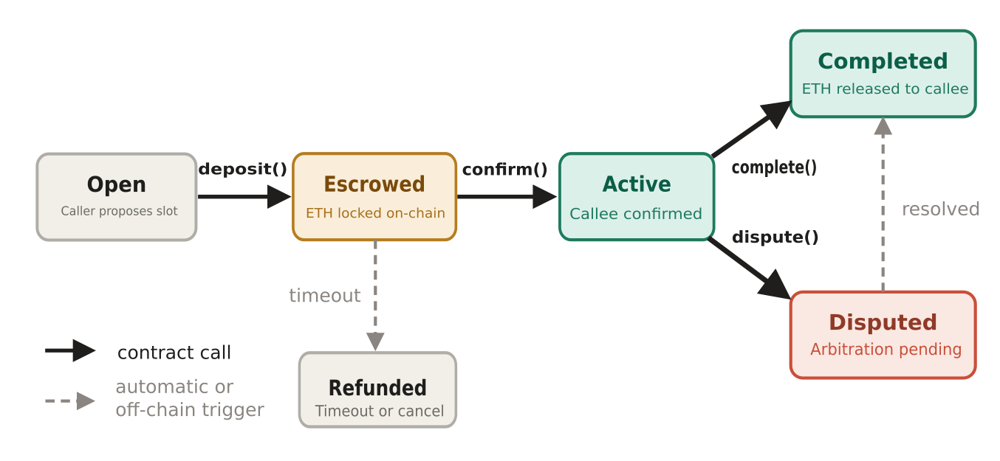
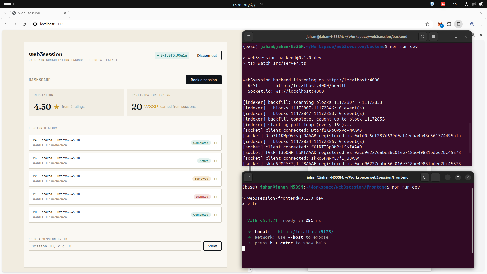

# web3session

A decentralized consultation marketplace. Smart contracts handle session agreements, escrow, and on-chain reputation.

---

## What it does

1. **Alice** connects her wallet and books a 30-minute consultation slot with **Bob**, depositing ETH into escrow.
2. **Bob** confirms availability on-chain and declares the time the session will start.
3. The session becomes `Active` and runs (shared scratchpad, or any external call, service or session tool of your choice).
4. Either party calls `completeSession()`. Escrow releases to Bob, and both parties earn a non-transferable participation token.
5. Alice and Bob rate each other. The score is stored permanently on-chain and compounds into reputation.

If Bob never confirms, Alice's ETH is refunded automatically after a configurable timeout. If there's a dispute, a lightweight arbitration path settles it without a third-party service.

---

**Contract addresses (Sepolia, chainId 11155111)**

| Contract | Address |
|---|---|
| SessionRegistry | [`0x446bbd951525F223024DfabB69EBA35346dfa166`](https://sepolia.etherscan.io/address/0x446bbd951525F223024DfabB69EBA35346dfa166#code) |
| Escrow | [`0xe8c4B36026Ff5168DaDe4529f9efDD8bf49BdC29`](https://sepolia.etherscan.io/address/0xe8c4B36026Ff5168DaDe4529f9efDD8bf49BdC29#code) |
| Reputation | [`0x04C05b90D619416198b6965E0491fe702d19c3AE`](https://sepolia.etherscan.io/address/0x04C05b90D619416198b6965E0491fe702d19c3AE#code) |
| ParticipationToken | [`0xf4328E6b125Bcc9B339C73166E06A53A57A363B6`](https://sepolia.etherscan.io/address/0xf4328E6b125Bcc9B339C73166E06A53A57A363B6#code) |

All four contracts are verified (click any address above to read the source directly on Etherscan).

---

## Contract state machine

<p>  </p>

`SessionRegistry.sol` owns the lifecycle. `Escrow.sol` is a standalone vault that only the registry can move funds through. `Reputation.sol` stores a cumulative `(total, count)` score per address so the average can be computed precisely off-chain. `ParticipationToken.sol` is a non-transferable ERC-20 minted to both parties on a clean completion (a proof-of-participation reward, not a currency).

**Contracts** (`contracts/`): four Solidity contracts covering the full session lifecycle, an escrow vault, cumulative reputation scoring, and a non-transferable participation reward; a Hardhat test suite with 44 tests covering successful flow, timing gate, dispute resolution, and reward logic.

**Backend** (`backend/`): a Node.js/Express REST API backed by Postgres, a polling event indexer that mirrors on-chain session and rating events into the database, and a Socket.io signaling layer that pushes live updates to connected clients without polling.

**Frontend** (`frontend/`): a React/TypeScript app built with Vite; wallet connect with MetaMask, a dashboard with live push updates, a session certificate view with role-aware action buttons, and a custom CSS design system with no external UI framework.

### Design considerations and screenshots

<div align="center">
  <div style="display: flex; justify-content: center; gap: 20px; flex-wrap: wrap;">
    <div style="text-align: center;">
      <h4><a href="./DESIGN.md">📐 Design Considerations</a></h4>
      <p><em>Click to view design rationale</em></p>
    </div>
    <div style="text-align: center;">
      <a href="https://jahanbakhsh18.github.io/web3session/">
        
      </a>
      <p><em><a href="https://jahanbakhsh18.github.io/web3session/">📸 Application screenshots</a></em></p>
    </div>
  </div>
</div>

---

## Quickstart

```bash
# 1. Clone
git clone https://github.com/jahanbakhsh18/web3session.git
cd web3session/contracts

# 2. Contracts
cp .env.example .env           # fill PRIVATE_KEY + INFURA_URL + ETHERSCAN_API_KEY
npm install
npx hardhat compile
npx hardhat test               # full suite: happy path, timeout, dispute, ratings
npx hardhat node               # local node in a separate terminal
npx hardhat run scripts/deploy.ts --network localhost

# 3. Backend
cd ../backend
cp .env.example .env          # fill DATABASE_URL, SEPOLIA_RPC_URL, SESSION_REGISTRY_ADDRESS
npm install
docker compose up -d          # starts Postgres
npm run db:migrate
npm run dev                   # starts REST API + Socket.io + indexer together

# Verify it's running:
curl http://localhost:4000/health
curl http://localhost:4000/api/sessions/0xYOUR_ADDRESS
curl http://localhost:4000/api/reputation/0xYOUR_ADDRESS

# 4. Frontend
cd ../frontend
cp .env.example .env          # fill deployed contract addresses
npm install
npm run dev                   # http://localhost:5173
```

After any contract change, re-sync ABIs to the frontend and backend:

```bash
npm run copy-abis             # from repo root
```

---

## Tech stack

**Contracts**: Solidity 0.8.28, Hardhat, ethers.js v6, OpenZeppelin (ERC-20 base for `ParticipationToken`), `@nomicfoundation/hardhat-network-helpers` (for time manipulation in tests), Deployed and verified on Sepolia testnet.

**Backend**: Node.js, Express, Socket.io (for real-time push notifications), PostgreSQL (as a read-optimized mirror of on-chain state), `dotenv` for configuration, The indexer is a polling-based event listener that runs in-process alongside the REST API.

**Frontend**: React, TypeScript, Vite, ethers.js v6 (for all contract reads and writes), `socket.io-client` (for the live push layer).

---

## License

MIT